

	

<h1 align="center" style="margin: 30px 0 30px; font-weight: bold;">聊软影视cms 1.0.0</h1>
<h4 align="center">基于ruoyi前后端分离的Java快速开发框架</h4>

## 平台简介
聊软影视管理系统，小剧场，茶杯狐，影视cms，方便二次开发

[后台项目 点这里，基于ruoyi](https://github.com/delonglimin/liaoruan-video-java)

[pc端ui点这里，基于nuxt，页面自适应移动端](https://github.com/delonglimin/liaoruan_video_web)

[后台ui点这里，基于vue3+ts](https://github.com/delonglimin/liaoruan_video_adminUI)

[app端点这里,基于uniapp](https://github.com/delonglimin/liaoruan_video_uniapp)

## 内置功能
- 栏目管理
- 影人管理
- 影视管理
- 视频管理
- 语言管理
- 国家管理
- 影人职务
- banner
- 其他请看下面图片

## 演示图
web 前端
<table>
    <tr>
        <td>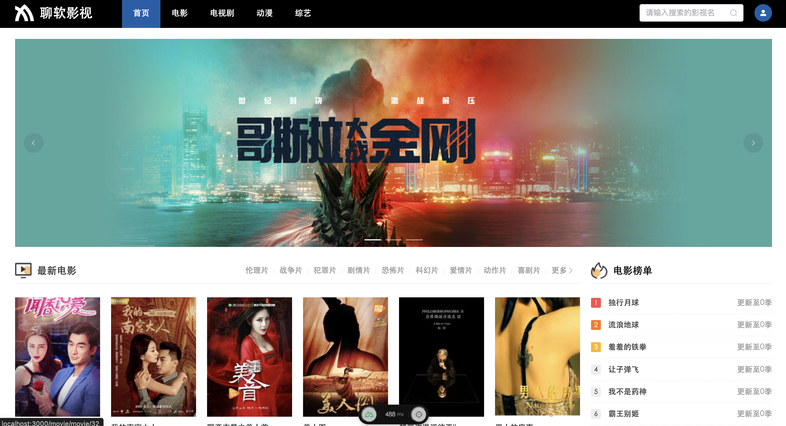</td>
        <td>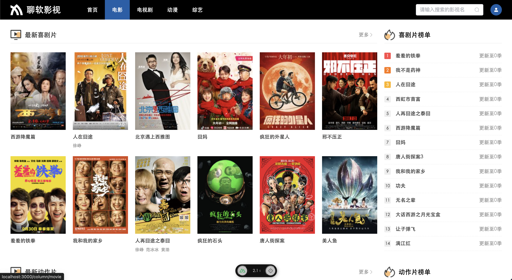</td>
    </tr>
<tr>
        <td>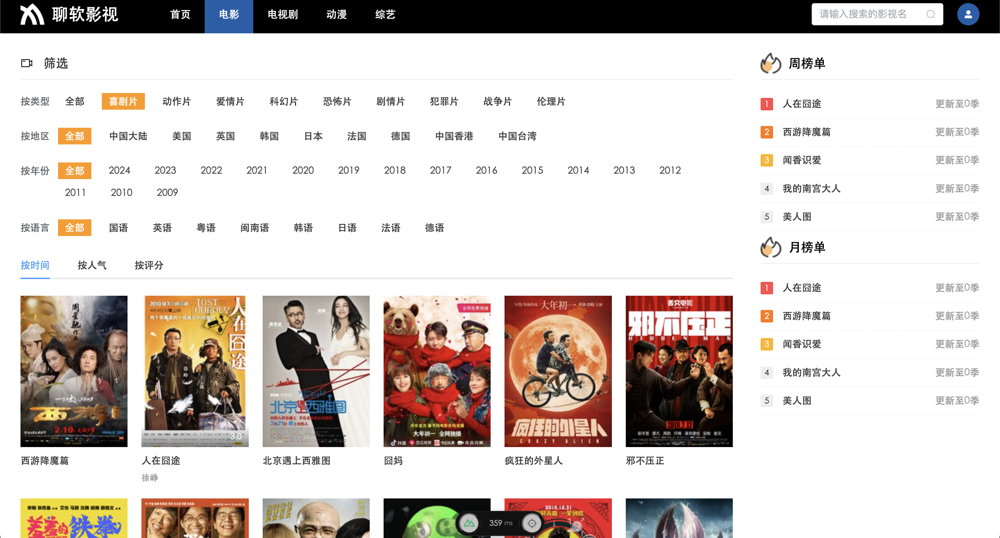</td>
        <td>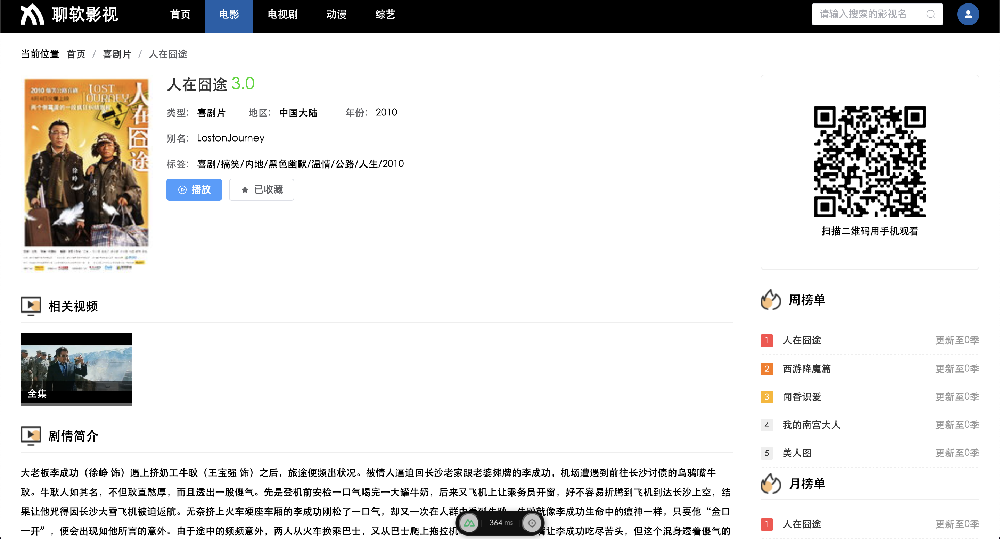</td>
    </tr>
<tr>
        <td>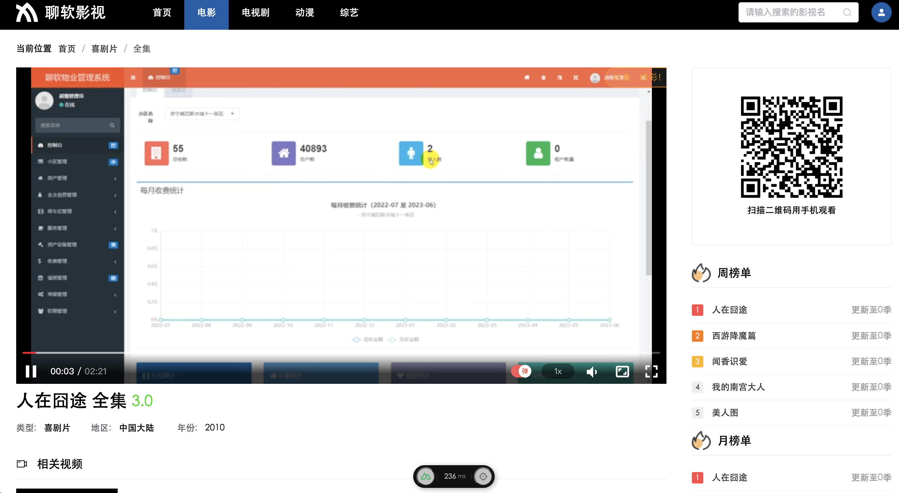</td>
        <td>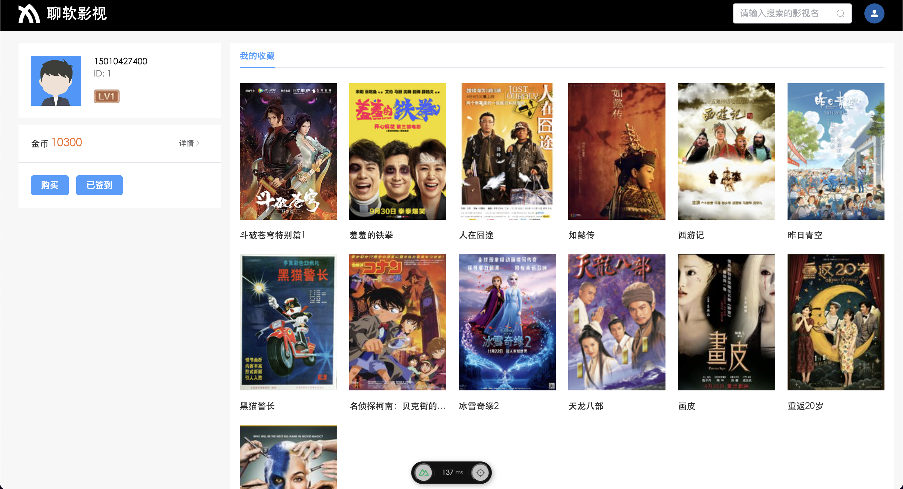</td>
    </tr>
<tr>
        <td>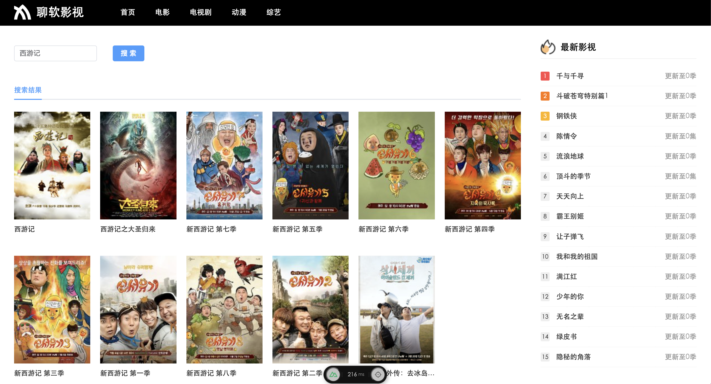</td>
    </tr>
   
</table>

web 控制台
<table>
    <tr>
        <td>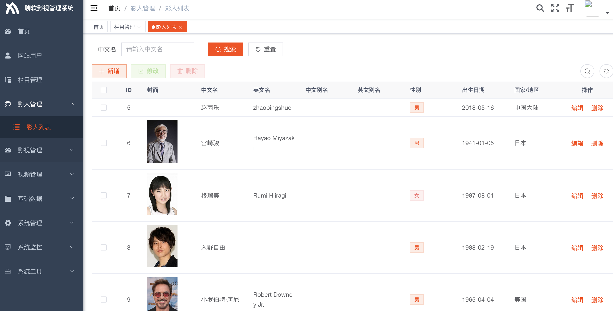</td>
        <td>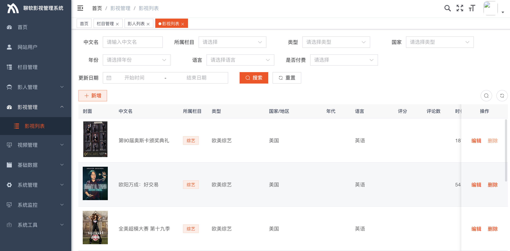</td>
    </tr>
<tr>
        <td>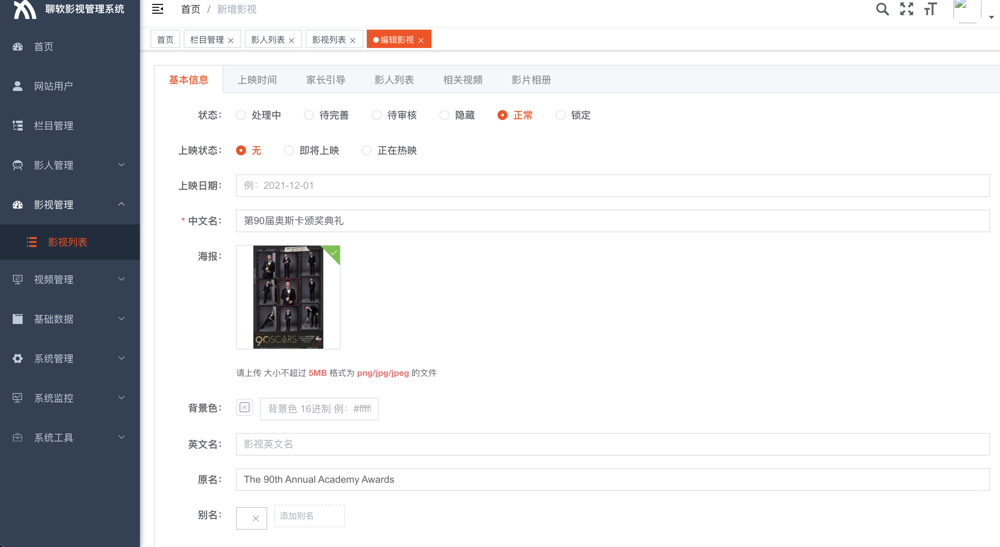</td>
        <td>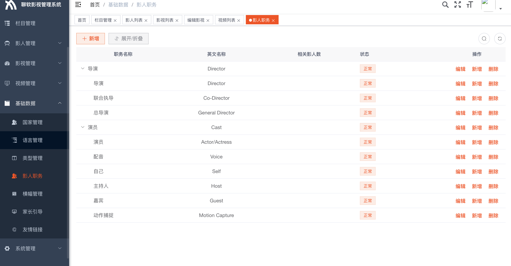</td>
    </tr>

</table>
<video width="320" height="240" controls> 
  <source src="/doc/video.mp4" type="video/mp4"> 
</video> 

## 联系方式
微信：delong123abc

主页：[https://liaoruan.xudelong.top/](https://liaoruan.xudelong.top/)

## 备注
项目基于node版chunyu而来，在此感谢作者
